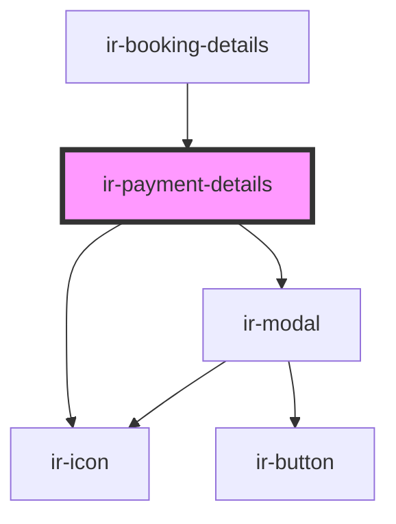

# ir-payment-details

<!-- Auto Generated Below -->

## Properties

| Property                  | Attribute                   | Description | Type     | Default     |
| ------------------------- | --------------------------- | ----------- | -------- | ----------- |
| `item`                    | `item`                      |             | `any`    | `undefined` |
| `paymentDetailsUrl`       | `payment-details-url`       |             | `string` | `""`        |
| `paymentExceptionMessage` | `payment-exception-message` |             | `string` | `""`        |

## Events

| Event                     | Description | Type               |
| ------------------------- | ----------- | ------------------ |
| `creditCardPressHandler`  |             | `CustomEvent<any>` |
| `handlePaymentItemChange` |             | `CustomEvent<any>` |

## Dependencies

### Used by

 - [ir-booking-details](..)

### Depends on

- [ir-icon](../../ir-icon)
- [ir-modal](../../ir-modal)

### Graph

----------------------------------------------

*Built with [StencilJS](https://stenciljs.com/)*
