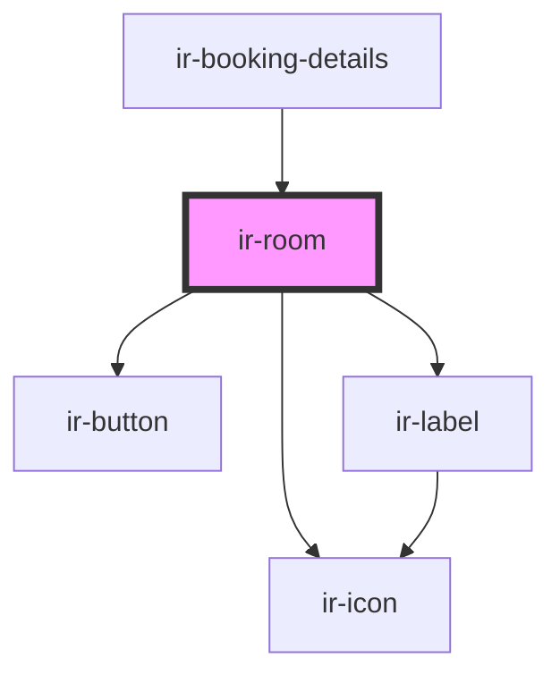

# ir-room

<!-- Auto Generated Below -->

## Properties

| Property        | Attribute         | Description | Type      | Default     |
| --------------- | ----------------- | ----------- | --------- | ----------- |
| `currency`      | `currency`        |             | `string`  | `'USD'`     |
| `hasCheckIn`    | `has-check-in`    |             | `boolean` | `false`     |
| `hasCheckOut`   | `has-check-out`   |             | `boolean` | `false`     |
| `hasRoomAdd`    | `has-room-add`    |             | `boolean` | `false`     |
| `hasRoomDelete` | `has-room-delete` |             | `boolean` | `false`     |
| `hasRoomEdit`   | `has-room-edit`   |             | `boolean` | `false`     |
| `item`          | `item`            |             | `any`     | `undefined` |
| `mealCode`      | `meal-code`       |             | `any`     | `undefined` |

## Events

| Event           | Description | Type               |
| --------------- | ----------- | ------------------ |
| `pressCheckIn`  |             | `CustomEvent<any>` |
| `pressCheckOut` |             | `CustomEvent<any>` |

## Dependencies

### Used by

 - [ir-booking-details](..)

### Depends on

- [ir-icon](../../ir-icon)
- [ir-button](../../ir-button)
- [ir-label](../../ir-label)

### Graph

----------------------------------------------

*Built with [StencilJS](https://stenciljs.com/)*
