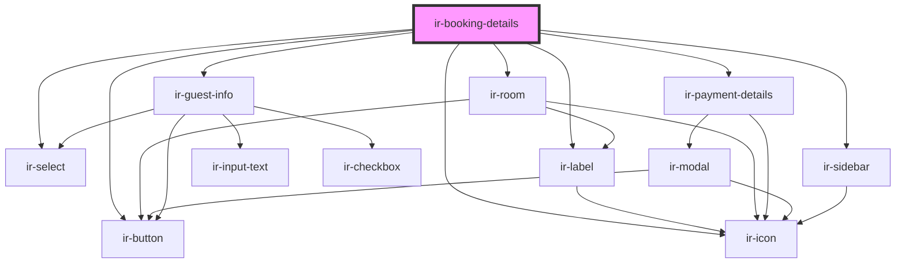

# ir-booking-details

<!-- Auto Generated Below -->

## Properties

| Property                 | Attribute           | Description | Type             | Default |
| ------------------------ | ------------------- | ----------- | ---------------- | ------- |
| `arrivalTimes`           | `arrival-times`     |             | `any`            | `[]`    |
| `bookingDetails`         | `booking-details`   |             | `any`            | `null`  |
| `bookingStatuses`        | `booking-statuses`  |             | `any`            | `[]`    |
| `dropdownStatuses`       | `dropdown-statuses` |             | `any`            | `[]`    |
| `foodArrangeCats`        | `food-arrange-cats` |             | `any`            | `[]`    |
| `hasCheckIn`             | `has-check-in`      |             | `boolean`        | `false` |
| `hasCheckOut`            | `has-check-out`     |             | `boolean`        | `false` |
| `hasDelete`              | `has-delete`        |             | `boolean`        | `false` |
| `hasMenu`                | `has-menu`          |             | `boolean`        | `false` |
| `hasPrint`               | `has-print`         |             | `boolean`        | `false` |
| `hasReceipt`             | `has-receipt`       |             | `boolean`        | `false` |
| `hasRoomAdd`             | `has-room-add`      |             | `boolean`        | `false` |
| `hasRoomDelete`          | `has-room-delete`   |             | `boolean`        | `false` |
| `hasRoomEdit`            | `has-room-edit`     |             | `boolean`        | `false` |
| `setupDataCountries`     | --                  |             | `selectOption[]` | `null`  |
| `setupDataCountriesCode` | --                  |             | `selectOption[]` | `null`  |

## Events

| Event                | Description | Type                     |
| -------------------- | ----------- | ------------------------ |
| `handleAddPayment`   |             | `CustomEvent<any>`       |
| `handleDeleteClick`  |             | `CustomEvent<any>`       |
| `handleMenuClick`    |             | `CustomEvent<any>`       |
| `handlePrintClick`   |             | `CustomEvent<any>`       |
| `handleReceiptClick` |             | `CustomEvent<any>`       |
| `handleRoomAdd`      |             | `CustomEvent<any>`       |
| `handleRoomDelete`   |             | `CustomEvent<any>`       |
| `handleRoomEdit`     |             | `CustomEvent<any>`       |
| `sendDataToServer`   |             | `CustomEvent<guestInfo>` |

## Dependencies

### Depends on

- [ir-select](../ir-select)
- [ir-button](../ir-button)
- [ir-icon](../ir-icon)
- [ir-label](label)
- [ir-room](ir-room)
- [ir-payment-details](ir-payment-details)
- [ir-sidebar](../ir-sidebar)
- [ir-guest-info](../ir-guest-info)

### Graph

----------------------------------------------

*Built with [StencilJS](https://stenciljs.com/)*
