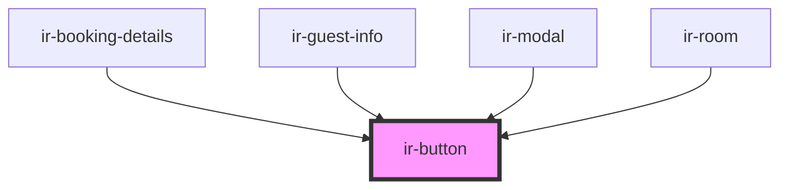

# ir-button

<!-- Auto Generated Below -->

## Properties

| Property       | Attribute      | Description | Type                                                                                            | Default     |
| -------------- | -------------- | ----------- | ----------------------------------------------------------------------------------------------- | ----------- |
| `btn_block`    | `btn_block`    |             | `boolean`                                                                                       | `true`      |
| `btn_color`    | `btn_color`    |             | `"danger" \| "dark" \| "info" \| "light" \| "primary" \| "secondary" \| "success" \| "warning"` | `'primary'` |
| `btn_disabled` | `btn_disabled` |             | `boolean`                                                                                       | `false`     |
| `btn_type`     | `btn_type`     |             | `string`                                                                                        | `'button'`  |
| `icon`         | `icon`         |             | `string`                                                                                        | `'ft-save'` |
| `name`         | `name`         |             | `string`                                                                                        | `undefined` |
| `size`         | `size`         |             | `"lg" \| "md" \| "sm"`                                                                          | `'md'`      |
| `text`         | `text`         |             | `any`                                                                                           | `undefined` |
| `textSize`     | `text-size`    |             | `"lg" \| "md" \| "sm"`                                                                          | `'md'`      |

## Events

| Event          | Description | Type               |
| -------------- | ----------- | ------------------ |
| `clickHanlder` |             | `CustomEvent<any>` |

## Dependencies

### Used by

 - [ir-booking-details](../ir-booking-details)
 - [ir-guest-info](../ir-guest-info)
 - [ir-modal](../ir-modal)
 - [ir-room](../ir-booking-details/ir-room)

### Graph

----------------------------------------------

*Built with [StencilJS](https://stenciljs.com/)*
