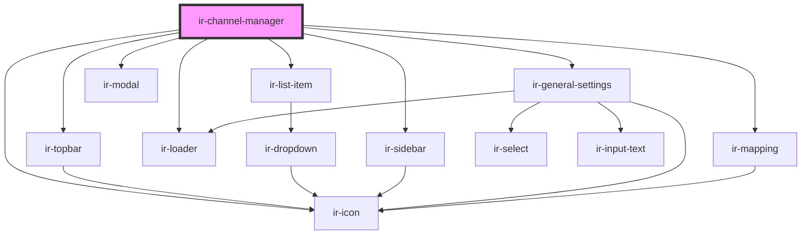

# ir-channel-manager

<!-- Auto Generated Below -->

## Properties

| Property       | Attribute | Description | Type                                                                                                                                | Default                                                                                                                                                                                                                                                                          |
| -------------- | --------- | ----------- | ----------------------------------------------------------------------------------------------------------------------------------- | -------------------------------------------------------------------------------------------------------------------------------------------------------------------------------------------------------------------------------------------------------------------------------- |
| `dropdownData` | --        |             | `{ name: string; icon: string; children: { name: string; icon: string; }[]; }`                                                      | `{     name: 'Action',     icon: '',     children: [       {         name: 'Edit',         icon: 'ft-edit',       },       {         name: 'Delete',         icon: 'ft-trash',       },       {         name: 'Disable',         icon: 'ft-alert-triangle',       },     ],   }` |
| `listData`     | --        |             | `{ title: string; channel: string; status: string; id: string; group: string; property: string; hotelId: string; mapping: any; }[]` | `[]`                                                                                                                                                                                                                                                                             |

## Dependencies

### Depends on

- [ir-icon](../ir-icon)
- [ir-topbar](../ir-topBar)
- [ir-list-item](../ir-listItems)
- [ir-sidebar](../ir-sidebar)
- [ir-loader](../ir-loader)
- [ir-general-settings](../ir-general-settings)
- [ir-mapping](../ir-mapping)
- [ir-modal](../ir-modal)

### Graph

----------------------------------------------

*Built with [StencilJS](https://stenciljs.com/)*
