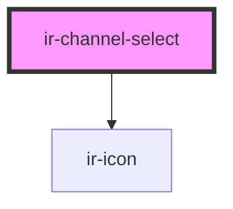

# ir-channel-select

<!-- Auto Generated Below -->

## Properties

| Property      | Attribute     | Description | Type      | Default |
| ------------- | ------------- | ----------- | --------- | ------- |
| `data`        | --            |             | `any[]`   | `[]`    |
| `icon`        | `icon`        |             | `boolean` | `false` |
| `label`       | `label`       |             | `string`  | `''`    |
| `placeholder` | `placeholder` |             | `string`  | `''`    |

## Events

| Event      | Description | Type               |
| ---------- | ----------- | ------------------ |
| `irSelect` |             | `CustomEvent<any>` |

## Dependencies

### Depends on

- [ir-icon](../ir-icon)

### Graph

----------------------------------------------

*Built with [StencilJS](https://stenciljs.com/)*
