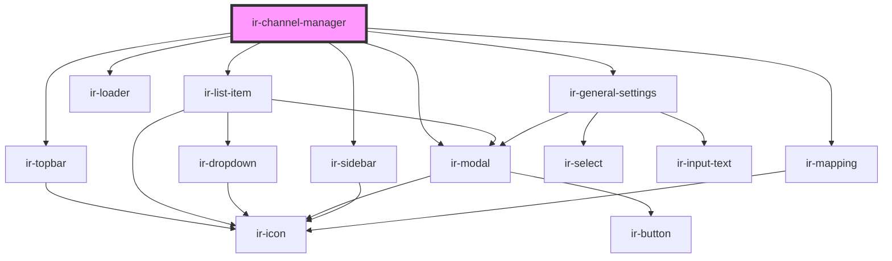

# ir-channel-manager

<!-- Auto Generated Below -->

## Properties

| Property               | Attribute | Description | Type                                                                           | Default                                                                                                                                                                                                                                                                          |
| ---------------------- | --------- | ----------- | ------------------------------------------------------------------------------ | -------------------------------------------------------------------------------------------------------------------------------------------------------------------------------------------------------------------------------------------------------------------------------- |
| `allowed_MinStayTypes` | --        |             | `selectOption[]`                                                               | `[]`                                                                                                                                                                                                                                                                             |
| `allowed_channels`     | --        |             | `selectOption[]`                                                               | `[]`                                                                                                                                                                                                                                                                             |
| `allowed_properties`   | --        |             | `selectOption[]`                                                               | `[]`                                                                                                                                                                                                                                                                             |
| `dropdownData`         | --        |             | `{ name: string; icon: string; children: { name: string; icon: string; }[]; }` | `{     name: 'Action',     icon: '',     children: [       {         name: 'Edit',         icon: 'ft-edit',       },       {         name: 'Delete',         icon: 'ft-trash',       },       {         name: 'Disable',         icon: 'ft-alert-triangle',       },     ],   }` |
| `hostRoom`             | --        |             | `RoomType[]`                                                                   | `undefined`                                                                                                                                                                                                                                                                      |
| `listData`             | --        |             | `ChannelManager[]`                                                             | `null`                                                                                                                                                                                                                                                                           |
| `mapReference`         | --        |             | `RoomType[]`                                                                   | `undefined`                                                                                                                                                                                                                                                                      |

## Events

| Event                            | Description | Type                            |
| -------------------------------- | ----------- | ------------------------------- |
| `fetchApi`                       |             | `CustomEvent<ChannelManager[]>` |
| `requestApiDelete`               |             | `CustomEvent<any>`              |
| `requestApiDestinationHierarchy` |             | `CustomEvent<string>`           |

## Dependencies

### Depends on

- [ir-topbar](../ir-topBar)
- [ir-list-item](../ir-listItems)
- [ir-sidebar](../../ir-sidebar)
- [ir-loader](../../ir-loader)
- [ir-general-settings](../ir-general-settings)
- [ir-mapping](../ir-mapping)
- [ir-modal](../../ir-modal)

### Graph

----------------------------------------------

*Built with [StencilJS](https://stenciljs.com/)*
