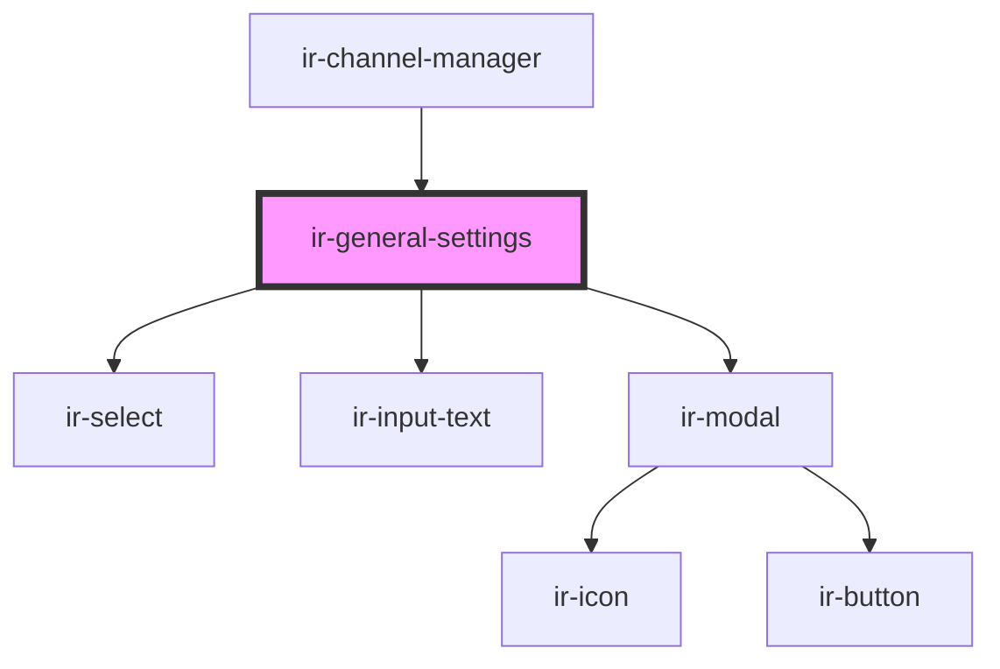

# ir-general-settings

<!-- Auto Generated Below -->

## Properties

| Property               | Attribute           | Description | Type             | Default                                                                                                                                                                                                                      |
| ---------------------- | ------------------- | ----------- | ---------------- | ---------------------------------------------------------------------------------------------------------------------------------------------------------------------------------------------------------------------------- |
| `allowed_MinStayTypes` | --                  |             | `selectOption[]` | `[]`                                                                                                                                                                                                                         |
| `allowed_channels`     | --                  |             | `selectOption[]` | `[]`                                                                                                                                                                                                                         |
| `allowed_properties`   | --                  |             | `selectOption[]` | `[]`                                                                                                                                                                                                                         |
| `connectionStatus`     | `connection-status` |             | `string`         | `'Not connected'`                                                                                                                                                                                                            |
| `data`                 | --                  |             | `ChannelManager` | `{     id: '123456',     channel: 'Channel Name',     status: 'Active',     //group: 'Group',     title: 'Title',     property: 'Property',     minimumStay: 'Arrival',     hotelId: 'hotelId',     RoomsMapping: null,   }` |
| `mode`                 | `mode`              |             | `string`         | `undefined`                                                                                                                                                                                                                  |

## Events

| Event           | Description | Type               |
| --------------- | ----------- | ------------------ |
| `connectionOff` |             | `CustomEvent<any>` |
| `sendToParent`  |             | `CustomEvent<any>` |

## Dependencies

### Used by

 - [ir-channel-manager](../ir-channel-manager)

### Depends on

- [ir-select](../../ir-select)
- [ir-input-text](../../ir-input-text)
- [ir-modal](../../ir-modal)

### Graph

----------------------------------------------

*Built with [StencilJS](https://stenciljs.com/)*
