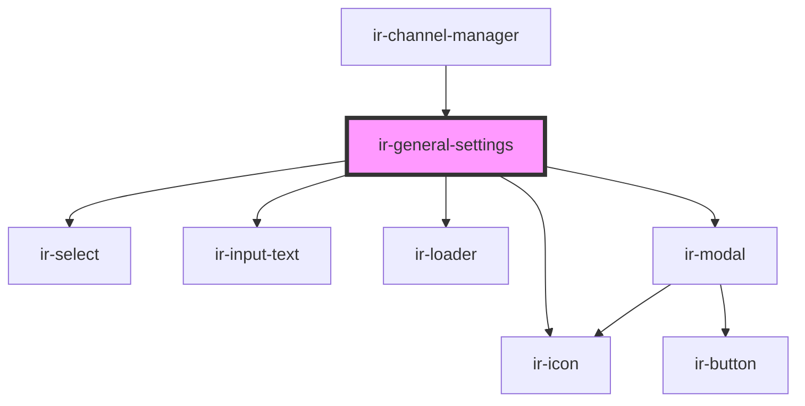

# ir-general-settings

<!-- Auto Generated Below -->

## Properties

| Property           | Attribute           | Description | Type     | Default                                                                                                                                          |
| ------------------ | ------------------- | ----------- | -------- | ------------------------------------------------------------------------------------------------------------------------------------------------ |
| `connectionStatus` | `connection-status` |             | `string` | `'Not connected'`                                                                                                                                |
| `data`             | `data`              |             | `any`    | `{     id: '123456',     channel: 'Channel Name',     group: 'Group',     title: 'Title',     property: 'Property',     hotelId: 'hotelId',   }` |
| `mode`             | `mode`              |             | `string` | `undefined`                                                                                                                                      |

## Events

| Event           | Description | Type               |
| --------------- | ----------- | ------------------ |
| `connectionOff` |             | `CustomEvent<any>` |
| `sendToParent`  |             | `CustomEvent<any>` |

## Dependencies

### Used by

 - [ir-channel-manager](../ir-channel-manager)

### Depends on

- [ir-select](../../ir-select)
- [ir-input-text](../../ir-input-text)
- [ir-loader](../../ir-loader)
- [ir-icon](../../ir-icon)
- [ir-modal](../../ir-modal)

### Graph

----------------------------------------------

*Built with [StencilJS](https://stenciljs.com/)*
