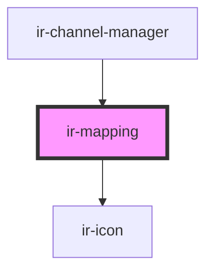

# ir-mapping

<!-- Auto Generated Below -->

## Properties

| Property       | Attribute | Description | Type         | Default     |
| -------------- | --------- | ----------- | ------------ | ----------- |
| `hostRoom`     | --        |             | `RoomType[]` | `[]`        |
| `map`          | --        |             | `RoomType[]` | `null`      |
| `mapReference` | --        |             | `RoomType[]` | `undefined` |

## Events

| Event                 | Description | Type               |
| --------------------- | ----------- | ------------------ |
| `sendMappingToParent` |             | `CustomEvent<any>` |

## Methods

### `_onSaveMapping() => Promise<void>`

#### Returns

Type: `Promise<void>`

## Dependencies

### Used by

 - [ir-channel-manager](../ir-channel-manager)

### Depends on

- [ir-icon](../../ir-icon)

### Graph

----------------------------------------------

*Built with [StencilJS](https://stenciljs.com/)*
