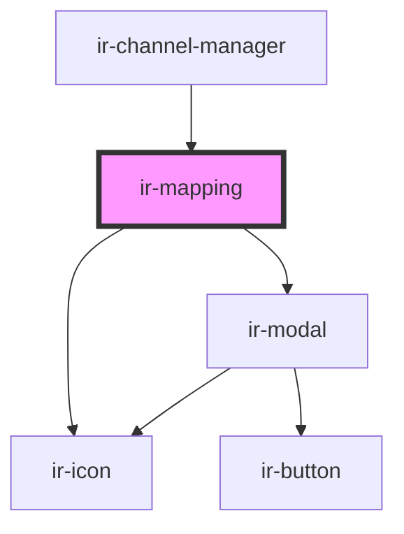

# ir-mapping

<!-- Auto Generated Below -->

## Properties

| Property | Attribute | Description | Type  | Default |
| -------- | --------- | ----------- | ----- | ------- |
| `map`    | `map`     |             | `any` | `{}`    |

## Events

| Event                 | Description | Type               |
| --------------------- | ----------- | ------------------ |
| `sendMappingToParent` |             | `CustomEvent<any>` |

## Methods

### `_onSaveMapping() => Promise<void>`

#### Returns

Type: `Promise<void>`

## Dependencies

### Used by

 - [ir-channel-manager](../ir-channel-manager)

### Depends on

- [ir-icon](../../ir-icon)
- [ir-modal](../../ir-modal)

### Graph

----------------------------------------------

*Built with [StencilJS](https://stenciljs.com/)*
