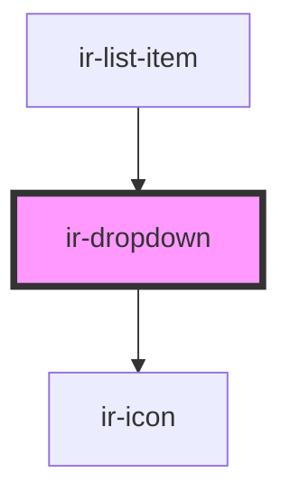

# ir-dropdown

<!-- Auto Generated Below -->

## Properties

| Property | Attribute | Description | Type                                                                           | Default |
| -------- | --------- | ----------- | ------------------------------------------------------------------------------ | ------- |
| `data`   | --        |             | `{ name: string; icon: string; children: { name: string; icon: string; }[]; }` | `null`  |
| `object` | `object`  |             | `any`                                                                          | `null`  |

## Events

| Event                 | Description | Type                                          |
| --------------------- | ----------- | --------------------------------------------- |
| `dropdownItemCLicked` |             | `CustomEvent<{ name: string; object: any; }>` |

## Dependencies

### Used by

 - [ir-list-item](../ir-channel/ir-listItems)

### Depends on

- [ir-icon](../ir-icon)

### Graph

----------------------------------------------

*Built with [StencilJS](https://stenciljs.com/)*
