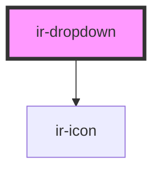

# ir-dropdown

<!-- Auto Generated Below -->

## Properties

| Property | Attribute | Description | Type                                                           | Default |
| -------- | --------- | ----------- | -------------------------------------------------------------- | ------- |
| `data`   | --        |             | `{ name: ""; icon: ""; children: { name: ""; icon: ""; }[]; }` | `null`  |

## Events

| Event                 | Description | Type                  |
| --------------------- | ----------- | --------------------- |
| `dropdownItemCLicked` |             | `CustomEvent<string>` |

## Dependencies

### Depends on

- [ir-icon](../ir-icon)

### Graph

----------------------------------------------

*Built with [StencilJS](https://stenciljs.com/)*
