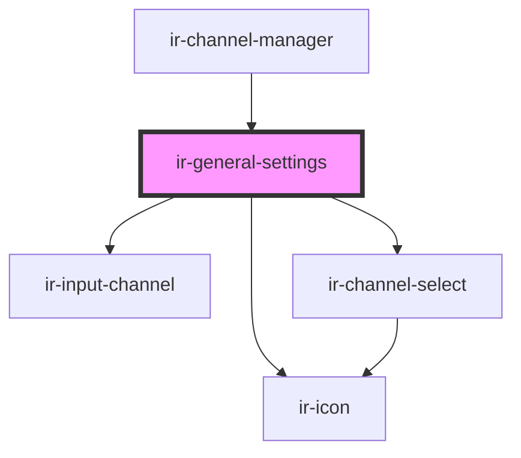

# ir-general-settings

<!-- Auto Generated Below -->

## Properties

| Property           | Attribute           | Description | Type     | Default                                                                                                                                           |
| ------------------ | ------------------- | ----------- | -------- | ------------------------------------------------------------------------------------------------------------------------------------------------- |
| `connectionStatus` | `connection-status` |             | `string` | `'Connected'`                                                                                                                                     |
| `data`             | `data`              |             | `any`    | `{     id: '123456',     channel: 'Channel Name',     group: 'Group',     title: 'Title',     property: 'Property',     hotelId: 'Hotel ID',   }` |
| `mode`             | `mode`              |             | `string` | `undefined`                                                                                                                                       |

## Dependencies

### Used by

 - [ir-channel-manager](../ir-channel-manager)

### Depends on

- [ir-input-channel](../ir-input-channel)
- [ir-channel-select](../ir-channel-select)
- [ir-icon](../ir-icon)

### Graph

----------------------------------------------

*Built with [StencilJS](https://stenciljs.com/)*
