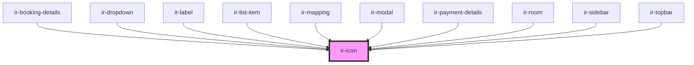

# ir-icon

<!-- Auto Generated Below -->

## Properties

| Property | Attribute | Description | Type     | Default      |
| -------- | --------- | ----------- | -------- | ------------ |
| `icon`   | `icon`    |             | `string` | `'ft-check'` |

## Events

| Event              | Description | Type               |
| ------------------ | ----------- | ------------------ |
| `iconClickHandler` |             | `CustomEvent<any>` |

## Dependencies

### Used by

 - [ir-booking-details](../ir-booking-details)
 - [ir-dropdown](../ir-dropdown)
 - [ir-label](../ir-label)
 - [ir-list-item](../ir-channel/ir-listItems)
 - [ir-mapping](../ir-channel/ir-mapping)
 - [ir-modal](../ir-modal)
 - [ir-payment-details](../ir-booking-details/ir-payment-details)
 - [ir-room](../ir-booking-details/ir-room)
 - [ir-sidebar](../ir-sidebar)
 - [ir-topbar](../ir-channel/ir-topBar)

### Graph

----------------------------------------------

*Built with [StencilJS](https://stenciljs.com/)*
