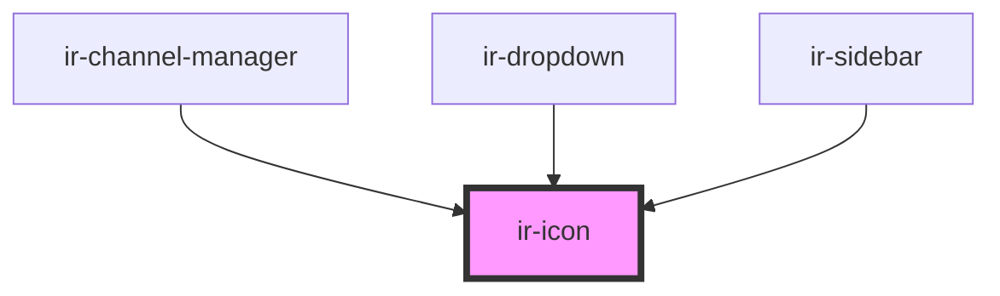

# ir-icon

<!-- Auto Generated Below -->

## Properties

| Property | Attribute | Description | Type     | Default      |
| -------- | --------- | ----------- | -------- | ------------ |
| `icon`   | `icon`    |             | `string` | `'ft-check'` |

## Dependencies

### Used by

 - [ir-channel-manager](../ir-channel-manager)
 - [ir-dropdown](../ir-dropdown)
 - [ir-sidebar](../ir-sidebar)

### Graph

----------------------------------------------

*Built with [StencilJS](https://stenciljs.com/)*
