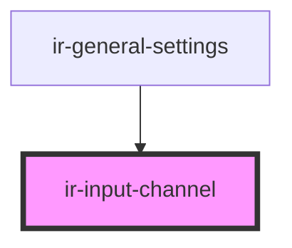

# ir-input-channel

<!-- Auto Generated Below -->

## Properties

| Property      | Attribute     | Description | Type     | Default |
| ------------- | ------------- | ----------- | -------- | ------- |
| `label`       | `label`       |             | `string` | `''`    |
| `placeholder` | `placeholder` |             | `string` | `''`    |
| `value`       | `value`       |             | `string` | `''`    |

## Events

| Event       | Description | Type               |
| ----------- | ----------- | ------------------ |
| `sendValue` |             | `CustomEvent<any>` |

## Dependencies

### Used by

 - [ir-general-settings](../ir-general-settings)

### Graph

----------------------------------------------

*Built with [StencilJS](https://stenciljs.com/)*
