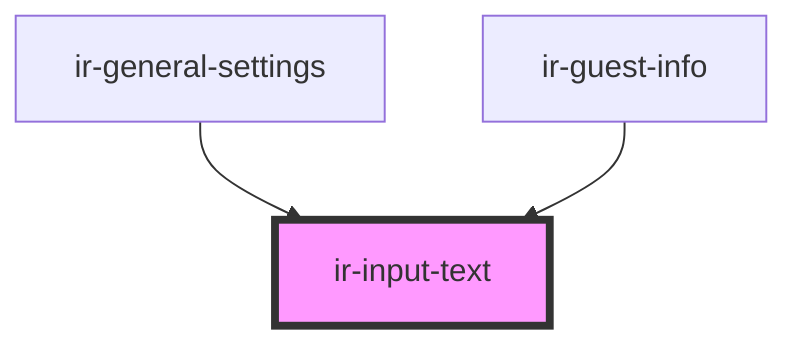

# ir-input-text

<!-- Auto Generated Below -->

## Properties

| Property          | Attribute          | Description | Type                                                                                                      | Default           |
| ----------------- | ------------------ | ----------- | --------------------------------------------------------------------------------------------------------- | ----------------- |
| `LabelAvailable`  | `label-available`  |             | `boolean`                                                                                                 | `true`            |
| `inputStyle`      | `input-style`      |             | `boolean`                                                                                                 | `true`            |
| `label`           | `label`            |             | `string`                                                                                                  | `'<label>'`       |
| `labelBackground` | `label-background` |             | `"danger" \| "dark" \| "info" \| "light" \| "primary" \| "secondary" \| "success" \| "warning"`           | `'light'`         |
| `labelBorder`     | `label-border`     |             | `"danger" \| "dark" \| "info" \| "light" \| "none" \| "primary" \| "secondary" \| "success" \| "warning"` | `'none'`          |
| `labelColor`      | `label-color`      |             | `"danger" \| "dark" \| "info" \| "light" \| "primary" \| "secondary" \| "success" \| "warning"`           | `'dark'`          |
| `labelPosition`   | `label-position`   |             | `"center" \| "left" \| "right"`                                                                           | `'left'`          |
| `labelWidth`      | `label-width`      |             | `1 \| 10 \| 11 \| 2 \| 3 \| 4 \| 5 \| 6 \| 7 \| 8 \| 9`                                                   | `3`               |
| `name`            | `name`             |             | `string`                                                                                                  | `undefined`       |
| `placeholder`     | `placeholder`      |             | `string`                                                                                                  | `'<placeholder>'` |
| `required`        | `required`         |             | `boolean`                                                                                                 | `undefined`       |
| `size`            | `size`             |             | `"lg" \| "md" \| "sm"`                                                                                    | `'md'`            |
| `submited`        | `submited`         |             | `boolean`                                                                                                 | `false`           |
| `textSize`        | `text-size`        |             | `"lg" \| "md" \| "sm"`                                                                                    | `'md'`            |
| `type`            | `type`             |             | `string`                                                                                                  | `'text'`          |
| `value`           | `value`            |             | `any`                                                                                                     | `undefined`       |

## Events

| Event        | Description | Type               |
| ------------ | ----------- | ------------------ |
| `textChange` |             | `CustomEvent<any>` |

## Dependencies

### Used by

 - [ir-general-settings](../ir-channel/ir-general-settings)
 - [ir-guest-info](../ir-guest-info)

### Graph

----------------------------------------------

*Built with [StencilJS](https://stenciljs.com/)*
