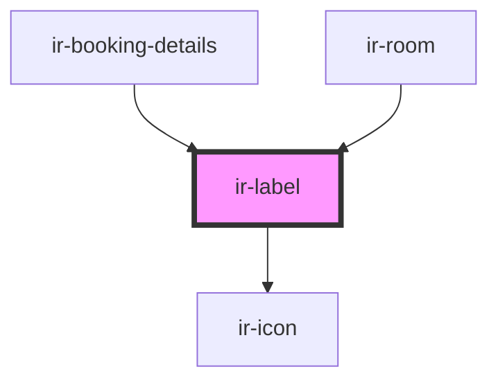

# ir-label

<!-- Auto Generated Below -->

## Properties

| Property    | Attribute    | Description | Type      | Default     |
| ----------- | ------------ | ----------- | --------- | ----------- |
| `iconShown` | `icon-shown` |             | `boolean` | `false`     |
| `imageSrc`  | `image-src`  |             | `string`  | `undefined` |
| `label`     | `label`      |             | `string`  | `undefined` |
| `value`     | `value`      |             | `string`  | `undefined` |

## Events

| Event         | Description | Type               |
| ------------- | ----------- | ------------------ |
| `editSidebar` |             | `CustomEvent<any>` |

## Dependencies

### Used by

 - [ir-booking-details](../ir-booking-details)
 - [ir-room](../ir-booking-details/ir-room)

### Depends on

- [ir-icon](../ir-icon)

### Graph

----------------------------------------------

*Built with [StencilJS](https://stenciljs.com/)*
