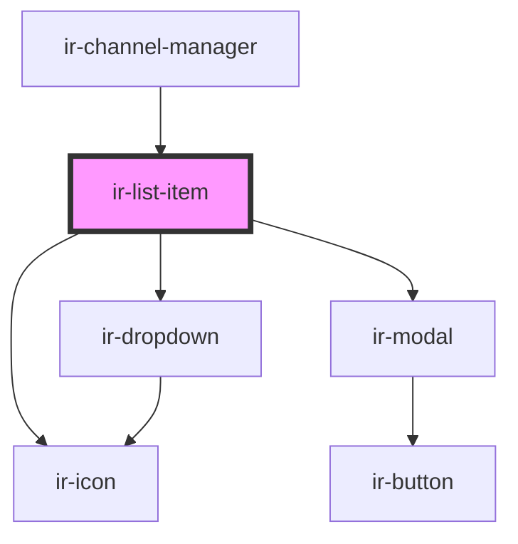

# ir-list-item

<!-- Auto Generated Below -->

## Properties

| Property              | Attribute | Description | Type                                                                                                                  | Default                                                                                                                                                                                                                                                                          |
| --------------------- | --------- | ----------- | --------------------------------------------------------------------------------------------------------------------- | -------------------------------------------------------------------------------------------------------------------------------------------------------------------------------------------------------------------------------------------------------------------------------- |
| `dropdownData`        | --        |             | `{ name: string; icon: string; children: { name: string; icon: string; }[]; }`                                        | `{     name: 'Action',     icon: '',     children: [       {         name: 'Edit',         icon: 'ft-edit',       },       {         name: 'Delete',         icon: 'ft-trash',       },       {         name: 'Disable',         icon: 'ft-alert-triangle',       },     ],   }` |
| `dropdownDataDisable` | --        |             | `{ name: string; icon: string; children: { name: string; icon: string; }[]; }`                                        | `{     name: 'Action',     icon: '',     children: [       {         name: 'Edit',         icon: 'ft-edit',       },       {         name: 'Delete',         icon: 'ft-trash',       },       {         name: 'Enable',         icon: 'ft-check',       },     ],   }`           |
| `listData`            | --        |             | `{ title: string; channel: string; status: string; id: string; group: string; property: string; hotelId: string; }[]` | `[     {       title: 'Title',       channel: 'Channel',       status: 'Status',       id: '1',       group: 'All',       property: 'Twins',       hotelId: '123',     },   ]`                                                                                                   |

## Events

| Event         | Description | Type               |
| ------------- | ----------- | ------------------ |
| `createNew`   |             | `CustomEvent<any>` |
| `openSidebar` |             | `CustomEvent<any>` |

## Dependencies

### Used by

 - [ir-channel-manager](../ir-channel-manager)

### Depends on

- [ir-dropdown](../ir-dropdown)
- [ir-icon](../ir-icon)
- [ir-modal](../ir-modal)

### Graph

----------------------------------------------

*Built with [StencilJS](https://stenciljs.com/)*
