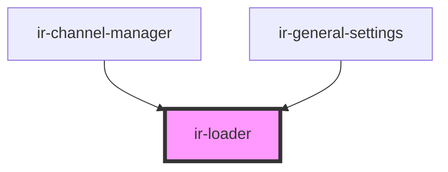

# ir-loader

<!-- Auto Generated Below -->

## Properties

| Property | Attribute | Description | Type     | Default |
| -------- | --------- | ----------- | -------- | ------- |
| `size`   | `size`    |             | `string` | `'md'`  |

## Dependencies

### Used by

 - [ir-channel-manager](../ir-channel/ir-channel-manager)
 - [ir-general-settings](../ir-channel/ir-general-settings)

### Graph

----------------------------------------------

*Built with [StencilJS](https://stenciljs.com/)*
