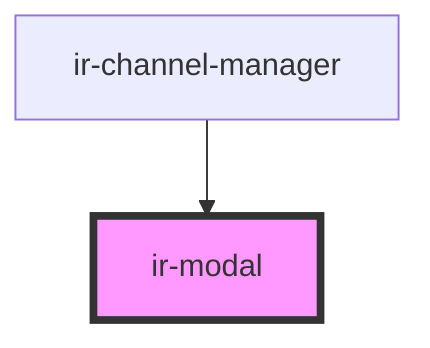

# ir-modal

<!-- Auto Generated Below -->

## Events

| Event          | Description | Type               |
| -------------- | ----------- | ------------------ |
| `confirmModal` |             | `CustomEvent<any>` |

## Methods

### `closeModal() => Promise<void>`

#### Returns

Type: `Promise<void>`

### `openModal() => Promise<void>`

#### Returns

Type: `Promise<void>`

## Dependencies

### Used by

 - [ir-channel-manager](../ir-channel-manager)

### Graph

----------------------------------------------

*Built with [StencilJS](https://stenciljs.com/)*
